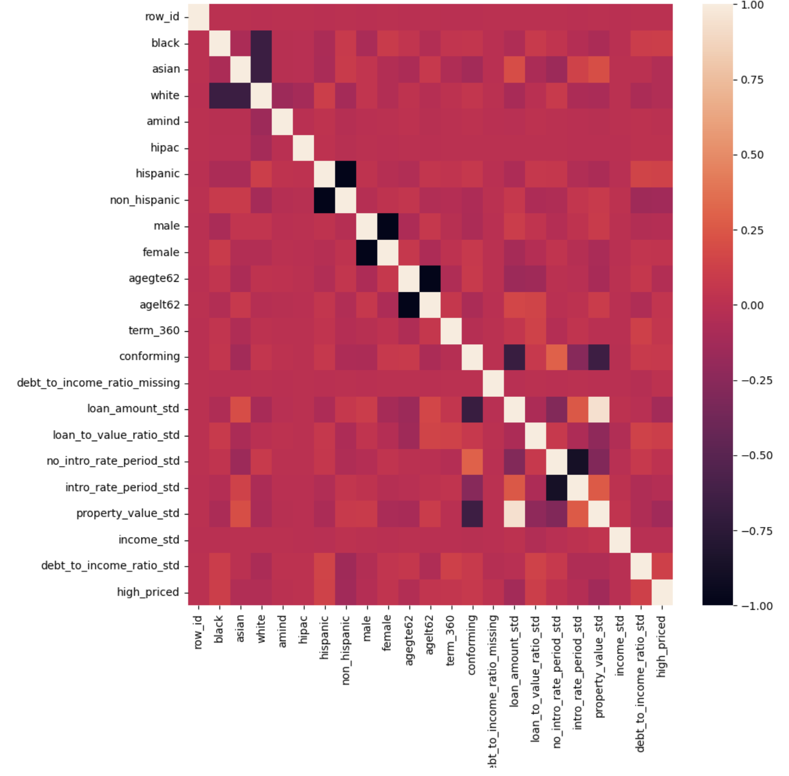

# Home Mortgage Disclosure Act (HMDA) Model Card

### Basic Information

* **Person or organization developing model**: Mariana Lungu, `marianalungu@gwu.edu`
* **Model date**: June 30, 2023
* **Model version**: 1.0
* **License**: MIT
* **Model implementation code**: [DNSC_6301_HMDA_Project.ipynb](https://github.com/marlungu/gwu_rml/blob/main/assignment_6/assignment_6.ipynb)

### Intended Use

* **Primary intended uses**: This model is an *example* probability of default classifier, with an *example* use case for determining eligibility for a credit line increase.
* **Primary intended users**: Students in GWU DNSC 6301 bootcamp.
* **Out-of-scope use cases**: Any use beyond an educational example is out-of-scope.


### Training Data

* Data:


* **Source of training data**: GWU Blackboard, email `jphall@gwu.edu` for more information
* **How training data was divided into training and validation data**: 70% training, 30% validation
* **Number of rows in training and validation data**:
  * Training rows: 112,253
  * Validation rows: 48,085


### Test Data

* **Source of test data**: GWU Blackboard, email `jphall@gwu.edu` for more information
* **Number of rows in test data**: 7,500
* **State any differences in columns between training and test data**: None


### Model details

* **Columns used as inputs in the final model**: 
        'income_std',
        'no_intro_rate_period_std',
        'debt_to_income_ratio_missing',
        'conforming',
        'intro_rate_period_std',
        'property_value_std',
        'debt_to_income_ratio_std',
        'term_360'
* **Column(s) used as target(s) in the final model**: 'high_priced'
* **Type of model**: Decision Tree
* **Software used to implement the model**: Python, scikit-learn
* **Version of the modeling software**: 1.0.2
* **Hyperparameters or other settings of your model**:

```
DecisionTreeClassifier(ntrees=1,
                        sample_rate=1,  # use all rows in that tree
                        mtries=-2,  # use all columns in that tree's split search
                        max_depth=4,  # shallow trees are easier to understand
                        seed=seed_,  # set random seed for reproducibility
                        nfolds=3,  # cross-validation for stability and ...
                        # only way to get metrics for 1 tree in h2o
                        model_id=model_id
                       )
```

### Quantitative Analysis

* Models were assessed primarily with AUC and AIR. See details below:

| Train AUC | Validation AUC 
| --------- | -------------- 
| 0.970011  | 0.623467

| Group | Validation AIR |
|-------|-----|
| Black vs. White | 0.8345 |
| Hispanic vs. White | 0.8765 |
| Asian vs. White | 1.098 |
| Female vs. Male | 1.245 |


#### Correlation Heatmap




