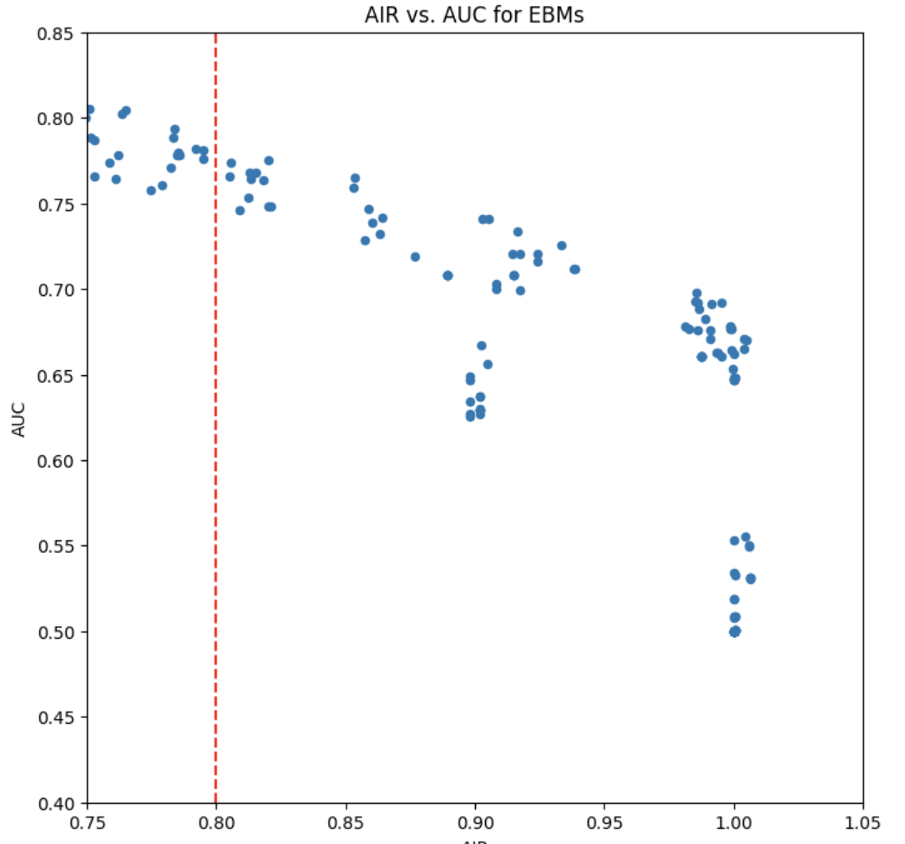

# Home Mortgage Disclosure Act (HMDA) Model Card

### Basic Information

* **Person or organization developing model**: Mariana Lungu, `marianalungu@gwu.edu`
* **Model date**: June 30, 2023
* **Model version**: 1.0
* **License**: MIT
* **Model implementation code**: [DNSC_6301_HMDA_Project.ipynb](https://github.com/marlungu/gwu_rml/blob/main/assignment_6/assignment_6.ipynb)

### Intended Use

* **Primary intended uses**: This model is not intended for business use; it's been developed for educational purposes. Its primary goal is to facilitate understanding and learning.
* **Primary intended users**: Students in GWU.
* **Out-of-scope use cases**: Any use beyond an educational example is out-of-scope.


### Training Data

* Data:


 * Columns:
        'row_id', 'black', 'asian', 'white', 'amind', 'hipac', 'hispanic',
        'non_hispanic', 'male', 'female', 'agegte62', 'agelt62', 'term_360',
        'conforming', 'debt_to_income_ratio_missing', 'loan_amount_std',
        'loan_to_value_ratio_std', 'no_intro_rate_period_std',
        'intro_rate_period_std', 'property_value_std', 'income_std',
        'debt_to_income_ratio_std', 'high_priced'
* **Source of training data**: GWU Blackboard, email `jphall@gwu.edu` for more information
* **How training data was divided into training and validation data**: 70% training, 30% validation
* **Number of rows in training and validation data**:
  * Training rows: 112,253
  * Validation rows: 48,085


### Test Data

* **Source of test data**: GWU Blackboard, email `jphall@gwu.edu` for more information
* **State any differences in columns between training and test data**: None


### Model details

* **Columns used as inputs in the final model**: 
       'term_360', 'conforming', 'debt_to_income_ratio_missing', 'loan_amount_std', 'loan_to_value_ratio_std', 'no_intro_rate_period_std',
           'intro_rate_period_std', 'property_value_std', 'income_std', 'debt_to_income_ratio_std'
* **Column(s) used as target(s) in the final model**: 'high_priced'
* **Type of model**: Decision Tree
* **Software used to implement the model**: Python, scikit-learn
* **Version of the modeling software**: 1.0.2
* **Hyperparameters or other settings of your model**:

```
DecisionTreeClassifier(ntrees=1,
                        sample_rate=1,  # use all rows in that tree
                        mtries=-2,  # use all columns in that tree's split search
                        max_depth=4,  # shallow trees are easier to understand
                        seed=seed_,  # set random seed for reproducibility
                        nfolds=3,  # cross-validation for stability and ...
                        # only way to get metrics for 1 tree in h2o
                        model_id=model_id
                       )
```

### Quantitative Analysis

* Models were assessed primarily with AUC and AIR. See details below:

| Train AUC | Validation AUC 
| --------- | -------------- 
| 0.970011  | 0.623467

| Group              | Validation AIR |
|--------------------|----------------|
| Black vs. White    |         0.816 |
| Hispanic vs. White |         0.8765 |
| Asian vs. White    |          1.208 |
| Female vs. Male    |          0.948 |


#### Correlation Heatmap


### Grid Search AIR vs. AUC for EBMs



* Below, we have a scatter plot of the Adverse Impact Ratio (AIR) against the Area Under the Receiver Operating Characteristic Curve (AUC) for the Explainable Boosting Machine (EBM) model. This plot enables us to examine the trade-off between fairness (as measured by AIR) and model performance (as measured by AUC).
The red vertical line drawn at AIR = 0.8 represents a fairness threshold. Any model falling to the right of this line would be fair according to the Four-Fifths Rule, commonly used in employment practices to measure disparate impact.
### Visualize simulated data

* Here we have histograms for each feature in the random_frame DataFrame, where each histogram displays the distribution of values for one feature.


### Sensitivity Analysis: Stress Testing
#### Simulate recession conditions in validation da


### Global residuals


### Plot tree depth vs. training and validation AUC


### View results as a table, using pandas iloc to remove first column of table


### Create a DataFrame for visualization & Sort by importance

* This extracts the feature importance scores from the model. Feature importance scores indicate how useful or valuable each feature was in constructing the boosted decision trees within the model. The higher the score, the more important the feature.


From the resulting plot, you can observe which features impact the model's predictions most.
### Bias

